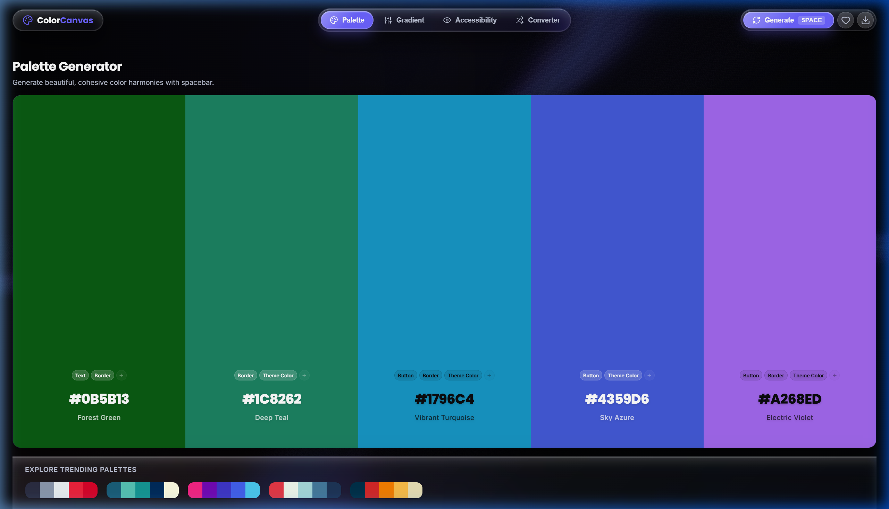

# ColorCanvas

A modern, all-in-one color toolkit for designers and developers — generate palettes, build gradients, check accessibility compliance, and convert between color formats. Built with a dark, glassmorphic UI featuring an animated gradient background.



## Features

### 🎨 Palette Generator
Generate 5-color palettes with a single keypress. Lock colors you like, drag to reorder, and get automatic usage suggestions for each swatch (Background, Text, Button, Border, Theme Color) — editable and dismissible per color.

### 🌈 Gradient Builder
Build multi-stop linear gradients with draggable handles directly on the preview bar. Copy production-ready CSS with one click.

### ✅ Accessibility Checker
Check foreground/background color pairs against WCAG 2.1 contrast standards (AA/AAA, Normal/Large text), with plain-language explanations of what each guideline means and a live preview of how your text will actually read.

### 🔄 Color Converter
Convert instantly between HEX, RGB, HSL, and CMYK, with one-click copy for every format, plus randomize/invert controls and a color-picker swatch trigger.

## Tech Stack

- **React 19** + **Vite** — build tooling with HMR
- **Tailwind CSS** — styling and theming
- **shadcn/ui** (Base UI primitives) — component foundation
- **React Bits** — animated micro-interactions and the Grainient animated gradient background
- **Oxlint** — linting
- Custom glassmorphism theme system with dark-mode CSS variable tokens

## Design Philosophy

ColorCanvas follows a premium, glass-forward dark theme:
- Full-bleed color columns for immediate visual feedback
- Animated gradient background with layered glass surfaces (cards, buttons, pills) that visually separate from it via blur, opacity, and elevation
- Auto-contrast text logic so labels and body copy stay legible on any background or swatch color
- Keyboard-first interactions (spacebar to regenerate palettes)
- WCAG-conscious design, including in the app's own UI

## Getting Started

### Prerequisites
- Node.js 18+
- npm

### Installation

```bash
# Clone the repo
git clone https://github.com/<your-username>/colorcanvas.git
cd colorcanvas

# Install dependencies
npm install

# Run the dev server
npm run dev
```

Open [http://localhost:5173](http://localhost:5173) to view it locally.

### Available Scripts

```bash
npm run dev       # Start the Vite dev server with HMR
npm run build     # Type-check and build for production
npm run lint      # Run Oxlint
npm run preview   # Preview the production build locally
```

## Project Structure
